

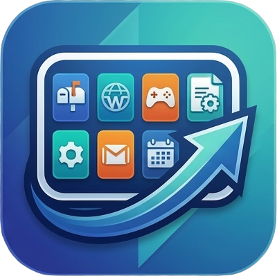

# 작업 그룹 런처 (WorkGroup)

**자주 쓰는 앱들을 하나의 그룹으로 묶어, 작업 표시줄에서 클릭 한 번으로 펼친다.**

PC에 설치된 앱들을 "작업 그룹"으로 묶고, 그 그룹을 Windows 11 작업 표시줄에 핀하여 클릭 한 번으로 그룹 안의 앱들을 아이콘 그리드 팝업에서 실행하는 데스크톱 앱입니다. 자주 같이 쓰는 앱들을 한곳에 모아 두면, 작업 표시줄을 어수선하게 만들지 않고도 빠르게 실행할 수 있습니다.

---

## 이런 분께 좋아요

- 작업 표시줄에 핀한 아이콘이 너무 많아 정리하고 싶은 분
- 업무·게임·디자인 등 **상황별로 앱 묶음**을 따로 두고 싶은 분
- 자주 여는 폴더를 트레이 클릭 한 번으로 **빠르게 열고** 싶은 분
- 설정이 외부로 나가지 않고 **내 PC에서만 동작**하는 가벼운 도구를 원하는 분

> 작업 그룹 런처는 작업 표시줄에 그룹 아이콘 하나만 핀합니다. 클릭하면 그 그룹에 담은 앱들이 팝업으로 펼쳐집니다.

---

## 지원 환경

| 항목 | 내용 |
|---|---|
| 운영체제 | Windows 11 |
| 지원 언어 | 한국어 · English · 日本語 · 简体中文 |
| 설치 형식 | MSIX 패키지 |

개발에 사용한 기술 (개발자용 참고)

- **UI 프레임워크**: WinUI 3 (Windows App SDK)
- **언어 / 런타임**: C# / .NET 10
- **구조**: DDD 레이어 (Domain · Application · Infrastructure · App) + 의존성 주입
- **데이터 저장**: 로컬 PC의 JSON 파일 (`%USERPROFILE%\WorkGroup\`, 외부 서버로 전송하지 않음)

---

## 처음 시작하기

1. **앱을 실행하면 메인 창이 열립니다.** 왼쪽에 메뉴(사이드바), 오른쪽에 해당 화면이 나타납니다.
2. **작업 표시줄 오른쪽 끝(시계 옆) 트레이**에 작업 그룹 런처 아이콘이 상주합니다.
3. **창을 닫아도 앱은 종료되지 않습니다.** 트레이에서 계속 동작합니다. 완전히 끄려면 트레이 메뉴의 **종료**를 사용하세요.
4. "작업 그룹" 화면에서 **그룹을 만들고**, 그 그룹을 **작업 표시줄로 끌어 핀**하면 준비가 끝납니다.

> 💡 작업 그룹 런처는 **단일 인스턴스**로 동작합니다. 이미 실행 중일 때 핀 아이콘을 누르거나 다시 실행하면, 새 창이 뜨지 않고 상주 중인 기존 인스턴스가 동작을 처리합니다.

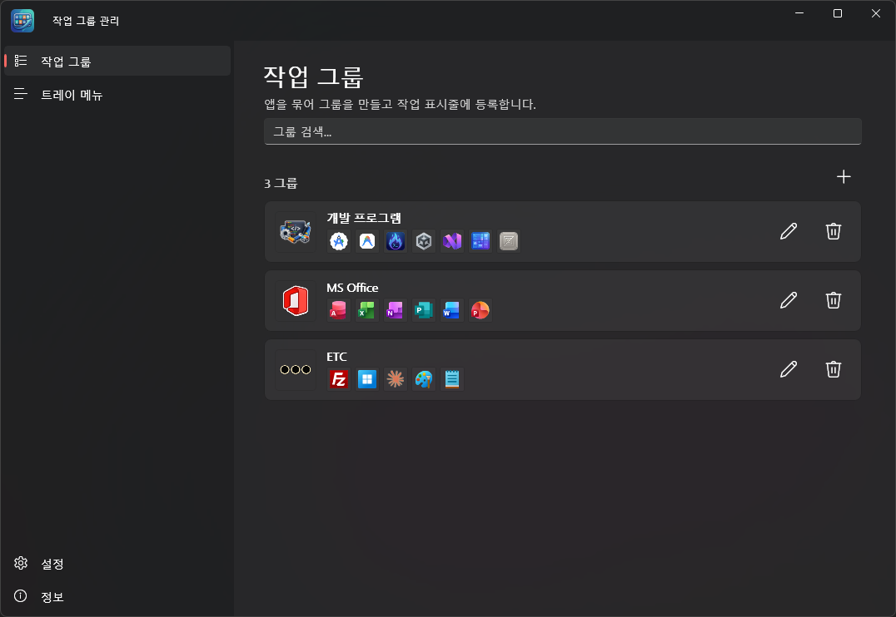

---

## 핵심 흐름 한눈에 보기

작업 그룹 런처는 크게 **두 가지** 기능을 제공합니다.

- **작업 그룹** — 설치된 앱들을 묶어 작업 표시줄에 핀하고, 클릭하면 멤버 앱들이 팝업으로 펼쳐집니다.
- **폴더 바로가기** — 자주 쓰는 디스크 폴더를 등록해 두고, 트레이 아이콘 **좌클릭**으로 폴더 목록 팝업을 띄워 빠르게 엽니다.

---

## 화면별 안내

메인 창은 왼쪽에 메뉴(사이드바)가 있고, 메뉴를 누르면 오른쪽에 해당 화면이 나타납니다. 메뉴 순서는 다음과 같습니다.

- 🗂️ **작업 그룹** — 그룹을 만들고 관리
- 📋 **트레이 메뉴(시작)** — 트레이 좌클릭으로 열릴 폴더 목록 관리
- ⚙️ **설정** (하단) — 자동 시작·테마·언어
- ℹ️ **정보** (하단) — 버전·오픈소스 라이선스

---

### 🗂️ 작업 그룹 화면

앱을 열면 가장 먼저 보이는 화면으로, **그룹을 만들고 관리**합니다.

- **그룹 목록** — 각 항목에 그룹 아이콘 + 이름 + 멤버 앱 아이콘이 표시되고, 항목마다 **수정·삭제** 아이콘 버튼이 있습니다.
- **그룹 검색** — 그룹 이름뿐 아니라 **멤버 앱 이름**으로도 검색할 수 있습니다.
- **그룹 추가** — 상단의 "그룹 추가" 버튼으로 새 그룹을 만듭니다.

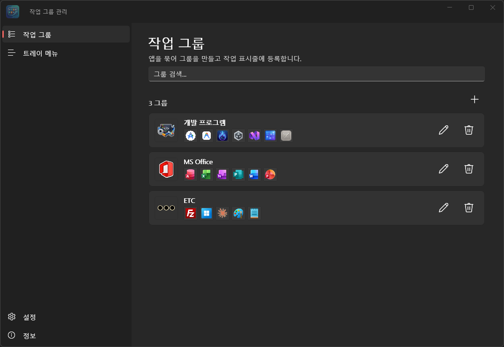

#### 그룹 추가 / 수정 다이얼로그
- 상단에 **[그룹 아이콘] [이름(최대 15자)]**이 있습니다.
- **"+"(앱 추가)** 버튼으로 설치된 앱을 골라 선택 목록에 담습니다. 항목별 삭제가 가능하며, 선택 목록 위 왼쪽에는 등록된 앱 개수("앱 N개")가 표시됩니다.
- **"파일 추가"(폴더 열기 아이콘) 버튼** — "+" 버튼 오른쪽에 있으며, 설치 앱 목록에 없는 실행 파일(.exe/.lnk)을 직접 골라 목록에 추가합니다.
- **"팝업 이름 표시" 토글** — "+" 버튼 왼쪽에 있으며, 그 그룹의 핀 팝업 상단에 그룹 이름 헤더를 표시할지를 그룹별로 정합니다. (신규 그룹은 기본 숨김)
- **그룹 아이콘** — 클릭하면 **사용자 이미지**(파일 선택) 또는 **리소스 아이콘**(번들 이미지 그리드) 중에서 고를 수 있습니다.
- 앱이 하나도 없거나 이름이 다른 그룹과 중복이면 추가가 차단됩니다.
- **수정 모드**에서는 이름이 읽기전용으로 표시되며, 클릭하면 입력창으로 전환됩니다. 이름을 바꾸면 "작업 표시줄에 등록한 기존 항목을 제거하고 다시 등록해야 한다"는 안내가 표시됩니다. (Windows 제약상 핀 표시 이름은 자동으로 바뀌지 않습니다.)

> 💡 **설치 앱 수집** — Win32(시작 메뉴 .lnk) 앱과 Store/UWP 앱을 현재 사용자 기준으로 함께 수집·검색합니다. 아이콘은 탐색기/시작 메뉴와 동일하게 셸이 렌더한 아이콘을 사용해 누락이나 여백 편차 없이 균일하게 표시됩니다.

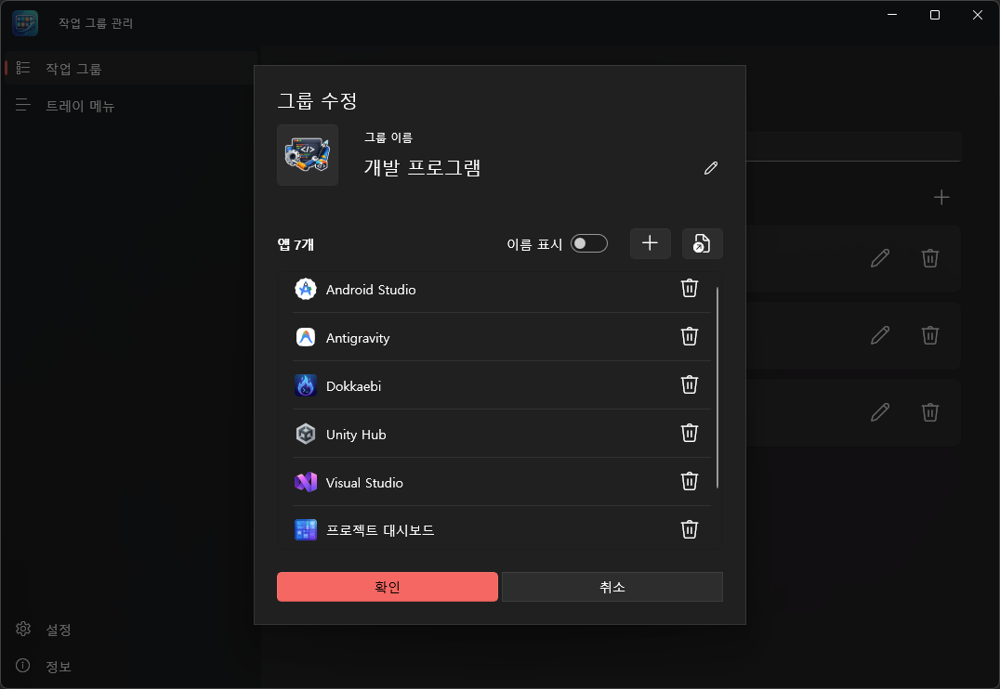

---

### 작업 표시줄에 핀하고 사용하기

#### 작업 표시줄 드래그 등록
- 그룹 목록의 항목을 **작업 표시줄로 끌어다 놓으면** 해당 그룹이 작업 표시줄에 핀(.lnk)됩니다.

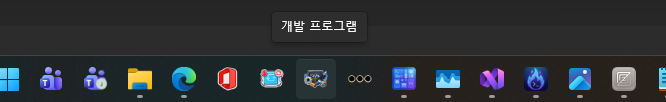

#### 그룹 팝업 런처
- 핀된 아이콘을 클릭하면 작업 표시줄 변에 접해 멤버 앱 아이콘을 나열한 **팝업**이 뜹니다.
- **작업 표시줄 위치에 따라 방향이 바뀝니다.**
  - 하단/상단이면 작업 표시줄 위/아래에 **가로 1행**으로,
  - 좌측/우측이면 작업 표시줄 오른쪽/왼쪽에 **세로 1열**로 표시됩니다.
  - 아이콘 수에 맞춰 크기가 자동 조정되고, 작업 영역을 넘으면 스크롤됩니다.
- **아이콘 클릭** — 해당 앱을 실행합니다. (Win32 셸 / 패키지 AUMID 모두 지원)
- 실행 파일이 삭제된 멤버(Win32)는 **흐리게·비활성**으로 표시되어 클릭되지 않습니다.
- **마우스 올리면** — 앱 이름이 툴팁으로 표시됩니다.
- **우클릭** — 컨텍스트 메뉴가 뜹니다.
  - **열기**
  - **관리자 권한으로 실행** (Win32 앱만 가능, 패키지 앱은 비활성화)
  - **그룹 수정** (메인 창을 열어 해당 그룹의 편집 다이얼로그 표시)
- 아이콘 목록 **끝의 "+" 버튼** — 우클릭 "그룹 수정"과 동일하게 해당 그룹의 편집 다이얼로그를 엽니다. (멤버가 없는 그룹에서도 표시됩니다.)
- 팝업 상단의 그룹 이름 헤더는 그룹의 "팝업 이름 표시" 설정을 따릅니다. (단, 좌/우 작업 표시줄의 세로 1열 팝업에서는 너비를 아이콘 폭에 맞추기 위해 헤더를 항상 숨깁니다.)

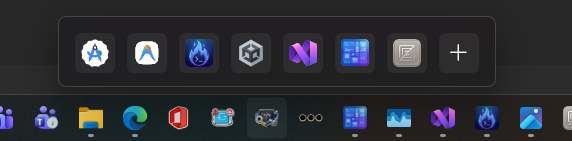

---

### 📋 트레이 메뉴(시작) 화면

트레이 아이콘 **좌클릭** 시 펼쳐질 **폴더 바로가기 목록**을 관리하는 화면입니다. (앞의 "작업 그룹"과는 별개 기능입니다.)

- **폴더 목록** — 등록된 폴더가 아이콘 + 이름 + 경로로 표시됩니다.
- **폴더 검색** — 등록된 폴더를 검색합니다.
- **추가** — "찾아보기"로 폴더를 선택해 등록합니다.
- **수정(연필)** — 폴더 표시 이름 등을 편집합니다.
- **⋯ 메뉴** — 위치 열기 / 삭제.
- **팝업 설정(톱니)** — 팝업의 표시 방식을 조정합니다.
  - **열 개수**(1~5: 1=세로 목록, 2~5=그리드)
  - **하위 폴더 탐색 깊이**(1~5)
  - **숨김 파일/폴더 표시 여부**

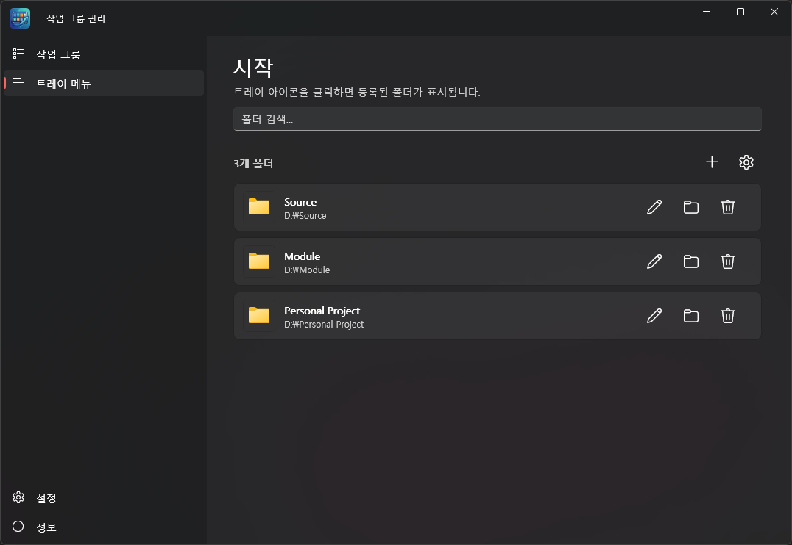

#### 트레이 좌클릭 폴더 팝업 사용하기
- 트레이 아이콘을 **좌클릭**하면 작업 표시줄 변 위에 등록한 폴더 목록 팝업이 뜹니다.
- **폴더 클릭** — 탐색기로 엽니다.
- **마우스를 올리면** — 그 안의 파일/하위 폴더가 2차 팝업으로 표시됩니다. (파일 클릭 시 기본 앱으로 실행, 하위 폴더는 설정한 깊이까지 재귀)
- 디스크에서 삭제된(존재하지 않는) 폴더는 목록에서 **흐리게·비활성**으로 표시되어 클릭/호버되지 않습니다.

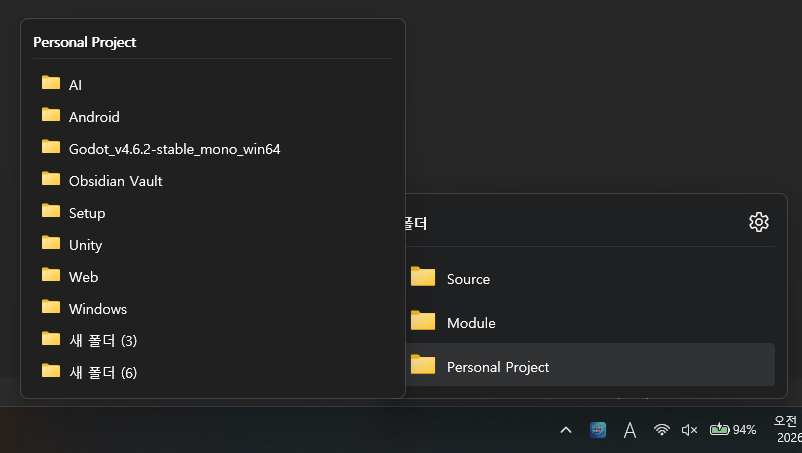

---

### ⚙️ 설정 화면

앱 전체의 동작을 관리합니다. (사이드바 하단)

- **로그인 시 자동 시작** — Windows에 로그인할 때 작업 그룹 런처를 자동으로 실행합니다. (토글)
- **앱 테마** — 시스템 / 라이트 / 다크 중에서 고릅니다. 설정에 저장되어 다음 실행에도 유지되며, 팝업 창에도 동일하게 적용됩니다.
- **표시 언어** — 시스템 언어 / 한국어 / English / 日本語 / 中文(简体) 중에서 고릅니다. 기본값은 **시스템 언어**(OS 언어를 따름)입니다. **언어를 바꾸면 확인 후 앱을 재시작**해 전체 UI와 시작 메뉴 표시 이름까지 적용합니다.
- **초기화** — 작업 그룹 목록과 트레이 메뉴(폴더) 목록을 각각 전체 삭제합니다. 실수를 막기 위해 확인 다이얼로그(기본 버튼=취소)를 거치며, 작업 그룹 초기화 시 생성된 바로가기·아이콘 산출물까지 함께 정리됩니다.

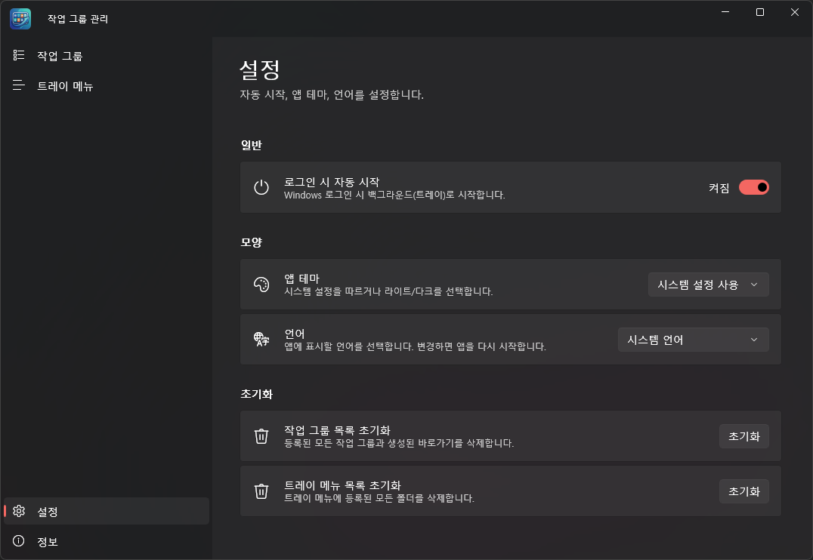

---

### ℹ️ 정보 화면

사이드바 맨 아래의 **정보** 메뉴에서 볼 수 있습니다.

- 앱 이름과 **버전** — 앱 이름 카드 오른쪽의 **"공식 홈페이지"** 링크를 누르면 기본 브라우저로 공식 홈페이지가 열립니다.
- **오픈소스 라이선스** — 앱이 사용하는 오픈소스 패키지 목록 (각 항목 클릭 시 해당 페이지로 이동)

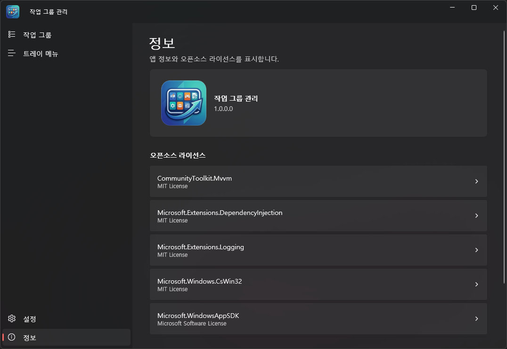

---

### 🐾 트레이 아이콘과 메뉴

작업 그룹 런처는 작업 표시줄 오른쪽 끝(시계 옆) **트레이**에 항상 떠 있습니다.

- **좌클릭** — 등록한 폴더 목록 팝업을 엽니다.
- **우클릭 메뉴** — 열기(메인 창) / 종료.

> 메인 창의 닫기(X)는 앱을 끄지 않고 트레이로 보냅니다. 완전히 종료하려면 트레이 메뉴의 **종료**를 사용하세요.

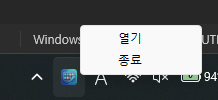

---

## 자주 묻는 질문

**Q. 창을 닫으면 앱이 꺼지나요?**
아니요. 트레이로 들어가 계속 동작합니다. 완전히 끄려면 트레이 메뉴의 "종료"를 누르세요.

**Q. 그룹을 작업 표시줄에 어떻게 올리나요?**
"작업 그룹" 화면의 그룹 항목을 **작업 표시줄로 끌어다 놓으면** 핀됩니다. 이후 그 아이콘을 클릭하면 멤버 앱 팝업이 펼쳐집니다.

**Q. 그룹 이름을 바꿨는데 작업 표시줄 핀 이름이 그대로예요.**
Windows 제약상 핀의 표시 이름은 자동으로 바뀌지 않습니다. 기존 핀을 제거하고 다시 작업 표시줄로 끌어 등록해 주세요.

**Q. 관리자 권한으로 실행이 안 되는 앱이 있어요.**
"관리자 권한으로 실행"은 **Win32 앱만** 가능합니다. Store/UWP(패키지) 앱에서는 비활성화됩니다.

**Q. 트레이 아이콘을 눌렀는데 폴더 목록이 비어 있어요.**
"트레이 메뉴(시작)" 화면에서 폴더를 먼저 등록해야 합니다. 등록한 폴더가 좌클릭 팝업으로 표시됩니다.

**Q. 내 설정은 어디에 저장되나요?**
모든 데이터는 `%USERPROFILE%\WorkGroup\` 아래에 로컬로 저장됩니다. 외부 서버로 전송하지 않습니다.

---

## 개인정보 및 데이터

작업 그룹 런처는 **서버 없이 사용자 PC에서 로컬로만 동작**합니다. 그룹 구성·폴더 목록·설정은 모두 내 PC 안(`%USERPROFILE%\WorkGroup\`)에만 저장되며, 외부 서버로 전송하지 않습니다.

- `groups.json` — 전체 그룹 인덱스 (루트)
- `folders.json` — 폴더 바로가기 목록 (루트)
- `Groups\{groupId}\` — 그룹별 산출물(작업 표시줄 핀용 .lnk, 핀 아이콘 .ico, 목록 표시용 .png). 그룹 삭제 시 폴더째 제거됩니다.
